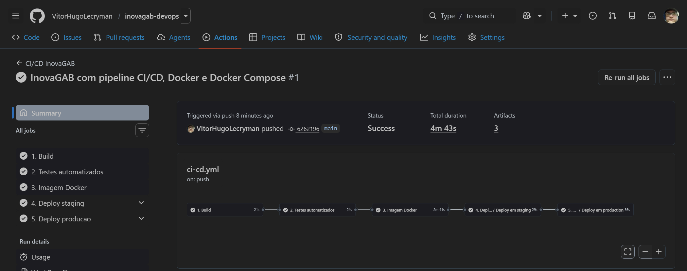
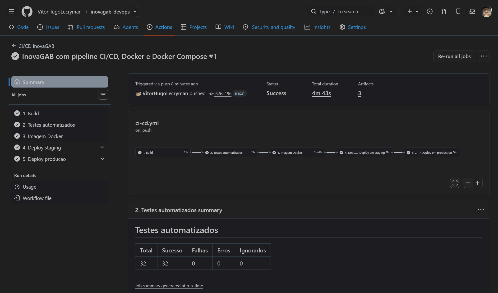
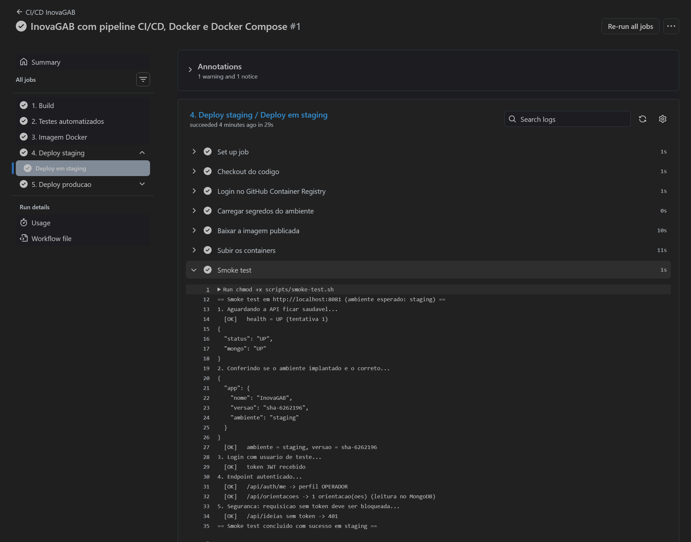
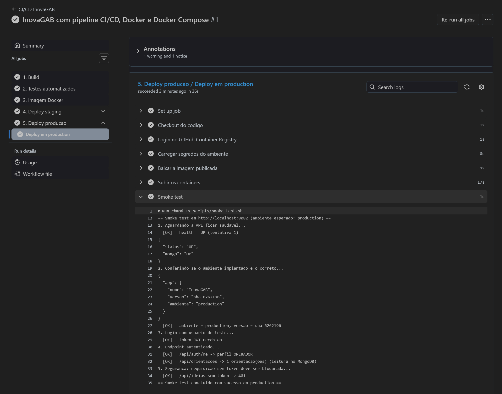

# Projeto - InovaGAB

Plataforma de inovação corporativa do Grupo Águia Branca: colaboradores enviam ideias, gestores
fazem a curadoria e líderes acompanham o portfólio de projetos por um dashboard.

Este repositório aplica práticas de **DevOps** sobre a API desenvolvida em **Java 21 + Spring Boot
3.3 + MongoDB 7**: containerização, orquestração com Docker Compose e um pipeline de CI/CD no
**GitHub Actions** com build, testes automatizados e deploy em **staging** e **produção**.

**Integrante:** Vitor Hugo — RM 559349

---

## Estrutura do projeto

```
inovagab-devops/
├── .github/workflows/
│   ├── ci-cd.yml            # pipeline principal: build -> testes -> imagem -> staging -> produção
│   └── deploy.yml           # deploy reutilizável (mesmos passos para staging e produção)
├── docs/
│   ├── documentacao-tecnica.html   # fonte da documentação
│   ├── InovaGAB - DevOps.pdf       # documentação técnica com evidências
│   ├── gerar-pdf.ps1               # regera o PDF depois de colocar os prints
│   └── prints/                     # evidências (pipeline, staging, produção)
├── env/
│   ├── staging.env          # configuração do ambiente de staging (sem segredos)
│   └── production.env       # configuração do ambiente de produção (sem segredos)
├── scripts/
│   └── smoke-test.sh        # validação executada após cada deploy
├── src/                     # código-fonte da API (main + 32 testes)
├── .dockerignore
├── .env.example             # modelo de variáveis para rodar localmente
├── Dockerfile
├── docker-compose.yml
├── pom.xml
└── README.md
```

---

## Como executar localmente com Docker

Pré-requisito: **Docker Desktop** (ou Docker Engine + Compose v2). Não é preciso ter Java nem
Maven instalados — a compilação acontece dentro do container.

1. (Opcional) Crie o arquivo de variáveis a partir do modelo. Sem ele, os valores padrão são usados.

   ```bash
   cp .env.example .env          # Linux / macOS
   copy .env.example .env        # Windows
   ```

2. Construa a imagem e suba a API + o banco:

   ```bash
   docker compose up -d --build
   ```

3. Acompanhe até os dois serviços ficarem `healthy`:

   ```bash
   docker compose ps
   docker compose logs -f api
   ```

4. Acesse:

   | Recurso | Endereço |
   |---|---|
   | API | http://localhost:8080 |
   | Swagger | http://localhost:8080/swagger-ui.html |
   | Health check | http://localhost:8080/actuator/health |
   | Info (ambiente e versão) | http://localhost:8080/actuator/info |

5. Usuários de teste (senha **123456**): `operador@inovagab.com`, `gestor@inovagab.com`,
   `lider@inovagab.com`.

6. Para derrubar o ambiente: `docker compose down` (mantém os dados) ou `docker compose down -v`
   (apaga também o volume do MongoDB).

### Simular staging e produção na sua máquina

Os mesmos arquivos usados pelo pipeline funcionam localmente. Cada ambiente sobe isolado, com
rede, volume e porta próprios:

```bash
docker compose -p inovagab-staging    --env-file env/staging.env    up -d --build   # porta 8081
docker compose -p inovagab-production --env-file env/production.env up -d --build   # porta 8082
```

---

## Pipeline CI/CD

**Ferramenta:** GitHub Actions — arquivos em [`.github/workflows/`](.github/workflows/).

```
 push / PR
    │
    ▼
┌─────────┐   ┌──────────────┐   ┌───────────────┐   ┌────────────────┐   ┌──────────────────┐
│ 1.Build │──▶│ 2.Testes     │──▶│ 3.Imagem      │──▶│ 4.Deploy       │──▶│ 5.Deploy         │
│ mvn     │   │ mvn verify   │   │ Docker → GHCR │   │ staging        │   │ produção         │
│ compile │   │ 32 testes    │   │ tag sha-xxxxx │   │ + smoke test   │   │ + smoke test     │
└─────────┘   └──────────────┘   └───────────────┘   └────────────────┘   └──────────────────┘
```

| Etapa | O que faz |
|---|---|
| **1. Build** | Instala o JDK 21 (com cache do Maven) e compila o projeto. Erro de compilação interrompe o pipeline. |
| **2. Testes automatizados** | `mvn verify` executa os 32 testes de regras de negócio (JUnit 5 + Mockito). Publica o resumo na página da execução e os relatórios e o `.jar` como artefatos. |
| **3. Imagem Docker** | Constrói a imagem pelo `Dockerfile` e publica no GitHub Container Registry com as tags `sha-<commit>`, `<branch>` e `latest` (na `main`). Em pull requests a imagem só é construída, para validar o Dockerfile. |
| **4. Deploy staging** | Baixa a imagem exata gerada na etapa 3, sobe API + MongoDB com `env/staging.env`, espera os healthchecks e roda o smoke test. |
| **5. Deploy produção** | Só roda na `main` e só depois de staging passar. Mesmos passos, com `env/production.env`. |

**Quando cada etapa roda**

| Evento | Build | Testes | Imagem | Staging | Produção |
|---|---|---|---|---|---|
| Pull request para `main` | ✔ | ✔ | só build | — | — |
| Push em `develop` | ✔ | ✔ | ✔ | ✔ | — |
| Push em `main` | ✔ | ✔ | ✔ | ✔ | ✔ |

**Garantias do fluxo**

- A mesma imagem (mesma tag `sha-…`) é promovida de staging para produção — o que foi
  validado em staging é exatamente o que vai para produção.
- O smoke test ([`scripts/smoke-test.sh`](scripts/smoke-test.sh)) confere: health `UP` com MongoDB
  conectado, o ambiente informado em `/actuator/info`, login JWT, um endpoint autenticado com
  leitura no banco e o bloqueio (401) de requisição sem token. Qualquer falha interrompe o
  pipeline e impede o deploy em produção.
- Cada deploy publica na página da execução (Summary) as evidências: containers, redes,
  volumes, `/actuator/health`, `/actuator/info` e o resultado do smoke test.

**Onde os ambientes rodam:** cada deploy sobe o ambiente em um runner do GitHub Actions
(máquina Linux dedicada e descartável), o valida e o encerra ao final. Staging e produção
rodam em máquinas separadas, com configuração e segredos separados (GitHub Environments).
Para apontar para um servidor permanente basta trocar `runs-on: ubuntu-latest` em
`deploy.yml` por um *self-hosted runner* instalado no servidor e remover o passo
"Encerrar ambiente efêmero".

### Configuração no GitHub (uma vez)

1. Crie um repositório e envie este projeto para a branch `main` (veja comandos abaixo).
2. Em **Settings → Environments**, os ambientes `staging` e `production` são criados
   automaticamente na primeira execução. Opcionalmente:
   - em `production`, marque **Required reviewers** para exigir aprovação manual antes do deploy;
   - cadastre os secrets por ambiente: `JWT_SECRET`, `MONGO_PASSWORD` (apenas letras e números)
     e `GEMINI_API_KEY`. Se não forem cadastrados, o pipeline gera `JWT_SECRET` e
     `MONGO_PASSWORD` aleatórios a cada deploy e a IA fica desativada (HTTP 503).
3. Os pipelines aparecem na aba **Actions**.

```bash
git init
git add .
git commit -m "InovaGAB com pipeline CI/CD, Docker e Docker Compose"
git branch -M main
git remote add origin https://github.com/<seu-usuario>/inovagab-devops.git
git push -u origin main

# para mostrar o fluxo de staging isolado:
git checkout -b develop
git push -u origin develop
```

---

## Containerização

### Dockerfile

```dockerfile
# ---------- Estagio 1: build ----------
FROM maven:3.9-eclipse-temurin-21 AS build
WORKDIR /build
COPY pom.xml .
RUN mvn -B -q dependency:go-offline
COPY src ./src
RUN mvn -B -q package -DskipTests \
    && cp target/inovagab-backend-*.jar app.jar

# ---------- Estagio 2: runtime ----------
FROM eclipse-temurin:21-jre-alpine
RUN addgroup -S inovagab && adduser -S inovagab -G inovagab
WORKDIR /app
COPY --from=build --chown=inovagab:inovagab /build/app.jar app.jar
USER inovagab
ENV SERVER_ADDRESS=0.0.0.0 \
    SERVER_PORT=8080 \
    JAVA_OPTS="-XX:MaxRAMPercentage=75.0 -XX:+UseContainerSupport"
EXPOSE 8080
HEALTHCHECK --interval=15s --timeout=5s --start-period=60s --retries=5 \
  CMD wget -qO- http://127.0.0.1:8080/actuator/health/liveness || exit 1
ENTRYPOINT ["sh", "-c", "exec java $JAVA_OPTS -jar /app/app.jar"]
```

### Estratégias adotadas

| Estratégia | Motivo |
|---|---|
| **Multi-stage build** | Maven e JDK ficam só no estágio de build. A imagem final leva apenas o JRE Alpine e o `.jar`, ficando bem menor. |
| **Cache de dependências** | O `pom.xml` é copiado e resolvido antes do código. Mudanças só no código não baixam as dependências de novo. No pipeline, o cache do Buildx (`type=gha`) reaproveita camadas entre execuções. |
| **Usuário não-root** | A aplicação roda como `inovagab`, reduzindo o impacto de uma eventual falha de segurança. |
| **Healthcheck** | O Docker sabe quando a API está pronta (`/actuator/health/liveness` e `/readiness`); o Compose só sobe a API depois do MongoDB estar saudável. |
| **Configuração por variáveis de ambiente** | A mesma imagem roda em local, staging e produção; muda apenas o ambiente. Segredos nunca ficam na imagem nem no repositório. |
| **`JAVA_OPTS` com `MaxRAMPercentage`** | A JVM respeita o limite de memória do container. |
| **`.dockerignore`** | `target/`, `.git`, documentação e arquivos `.env` não entram no contexto de build. |

### Orquestração — `docker-compose.yml`

| Recurso | Como foi usado |
|---|---|
| **Serviços** | `api` (Spring Boot) e `mongo` (MongoDB 7). |
| **Rede** | `inovagab-net` (bridge). O MongoDB **não** expõe porta para fora; só a API o acessa pelo nome `mongo`. |
| **Volume** | `mongo-data` persiste os dados do banco entre reinícios. |
| **Variáveis de ambiente** | Perfil Spring, nome do ambiente, versão, URI do Mongo com usuário e senha, segredo JWT, carga inicial e chave de IA. Valores vêm do `.env` (local) ou de `env/*.env` + secrets (pipeline). |
| **Dependência com healthcheck** | `depends_on: condition: service_healthy` — a API só inicia com o banco pronto. |
| **Política de reinício** | `restart: unless-stopped` nos dois serviços. |

### Diferenças entre os ambientes

| | Local | Staging | Produção |
|---|---|---|---|
| Arquivo | `.env` | `env/staging.env` | `env/production.env` |
| Perfil Spring | `default` | `staging` | `prod` |
| Porta | 8080 | 8081 | 8082 |
| Banco | `inovagab` | `inovagab_staging` | `inovagab` |
| Log da aplicação | DEBUG | DEBUG | INFO |
| Validade do token JWT | 480 min | 480 min | 120 min |
| Segredos | valores de desenvolvimento | secrets do environment `staging` | secrets do environment `production` |

---

## Prints do funcionamento

As evidências estão em [`docs/prints/`](docs/prints/) e também na documentação em PDF.

- Repositório: https://github.com/VitorHugoLecryman/inovagab-devops
- Execução do pipeline registrada nos prints: https://github.com/VitorHugoLecryman/inovagab-devops/actions/runs/37876840127

| Evidência | Arquivo |
|---|---|
| Pipeline completo (todas as etapas verdes) | `docs/prints/01-pipeline-completo.png` |
| Etapa de build | `docs/prints/02-build.png` |
| Testes automatizados (resumo com 32 testes) | `docs/prints/03-testes.png` |
| Imagem publicada no GHCR | `docs/prints/04-imagem-docker.png` |
| Deploy em staging + smoke test | `docs/prints/05-deploy-staging.png` |
| Deploy em produção + smoke test | `docs/prints/06-deploy-producao.png` |
| Ambientes `staging` e `production` no GitHub | `docs/prints/07-environments.png` |






---

## Tecnologias utilizadas

| Categoria | Tecnologia |
|---|---|
| Linguagem / framework | Java 21, Spring Boot 3.3 (Web, Security, Data MongoDB, Validation, Actuator) |
| Banco de dados | MongoDB 7 |
| Segurança | Spring Security + JWT (jjwt 0.12) |
| Documentação da API | springdoc-openapi (Swagger UI) |
| Testes | JUnit 5, Mockito, Spring Boot Test |
| Build | Maven 3.9 |
| Containerização | Docker (multi-stage, Eclipse Temurin 21 JRE Alpine) |
| Orquestração | Docker Compose v2 |
| CI/CD | GitHub Actions, GitHub Environments |
| Registro de imagens | GitHub Container Registry (ghcr.io) |
| Integração de IA | Google Gemini |

---

## Checklist de entrega

| Item | OK |
|---|---|
| Projeto compactado em .ZIP com estrutura organizada | ☑ |
| Dockerfile funcional | ☑ |
| docker-compose.yml ou arquivos Kubernetes | ☑ |
| Pipeline com etapas de build, teste e deploy | ☑ |
| README.md com instruções e prints | ☑ |
| Documentação técnica com evidências (PDF ou PPT) | ☑ |
| Deploy realizado nos ambientes staging e produção | ☑ |
